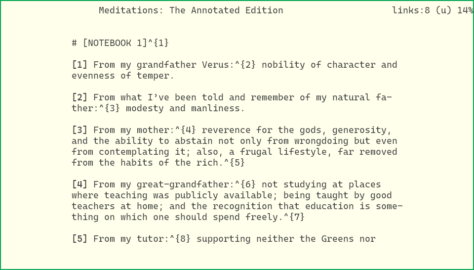

# `repy`

## ⚠️ MASSIVE WARNING ⚠️

**This is 100% AI-generated code.** Every single line was written by
[Codex CLI](https://github.com/openai/codex), [Gemini CLI](https://github.com/google-gemini/gemini-cli),
and [Claude Code](https://claude.ai/claude-code) — the human has not written a single line of Rust.
That said, it works well for daily use. No guarantee it won't eat your epub, delete your database,
or crash your terminal. You're on your own. PRs welcome.

---

Rust reimplementation of the awesome CLI ebook reader [`epy`](https://github.com/wustho/epy).

The goal is to keep the reading experience and keybindings familiar while improving
performance, robustness, and portability by using Rust and a fully self-contained
SQLite implementation.


*A clean reading experience in `repy`, showing Marcus Aurelius's Meditations with hyphenation, footnote markers, and progress tracking.*

## Status

**Functional for daily use!** Core reading features are complete: TUI navigation, search, bookmarks,
library management, two-phase cursor/selection modes, image viewing, link/footnote handling, dictionary lookup,
and Wikipedia lookup all work. Text is intelligently wrapped and hyphenated. Reading state and
preferences are persisted per-book.

**Not yet implemented:** TTS (text-to-speech), export functionality,
advanced search features (history, fuzzy, incremental), mouse support, and additional ebook formats beyond EPUB.

See [to-do.md](to-do.md) for detailed feature status and roadmap.

## Installation

### Download Binaries

You can download pre-built binaries for Linux, Windows, and macOS from the [GitHub Releases](https://github.com/newptcai/repy/releases) page.

- **Linux**: Download `repy-linux-x86_64` (compatible with most modern distributions).
- **Windows**: Download `repy-windows-x86_64.exe`.
- **macOS**: Download `repy-macos-universal` (works natively on both Intel and Apple Silicon Macs).

After downloading, rename the file to `repy` (or `repy.exe` on Windows) and make it executable:

```sh
# Linux/macOS
chmod +x repy-*-*
mv repy-*-* /usr/local/bin/repy
```

### Build from source

If you prefer to build it yourself, you need Rust and Cargo installed.

```sh
# Clone this repository
git clone https://github.com/newptcai/repy.git
cd repy

# Build and install
cargo install --path .
```

The bundled `rusqlite` feature is enabled, so no system-wide `libsqlite3`
installation is required; SQLite is compiled and linked as part of the build.

## Usage

### Opening a book

To open any EPUB file (doesn't need to be in your library):

```sh
repy /path/to/book.epub
```

### Starting without arguments

```sh
repy
```

If there is a reading history, `repy` reopens the last-read book at the last saved
position. Otherwise, it starts in the reader UI without a book loaded.

### Other options

```sh
repy -c FILE     # Use a specific configuration file
repy -v          # Increase verbosity (for debugging)
repy --debug     # Enable debug output
```

Note: `-r` (history) and `--dump` options are defined but not yet implemented.

### Search

Search functionality supports regular expressions.

- **Start Search**: Press `/` to open the search input.
- **Navigation**:
  - `Enter`: Jump to the selected result (or the first one if freshly searching).
  - `n`: Jump to the next search hit.
  - `p` / `N`: Jump to the previous search hit.
- **Clear Highlights**: There is no dedicated key to clear highlights. A workaround is to press `/` to start a new search (which clears existing highlights) and then `Esc` to cancel.
- **Current Hit**: All matching text is highlighted in yellow. When navigating with `n`, `p`, or `N`, the view jumps to the line containing the match, but the "current" hit is not visually distinguished from other matches on the screen.

## Keybindings

Press `?` in the TUI to see the help window at any time (`Help (?)`).

### Navigation
- `k` / `Up` — Line Up
- `j` / `Down` — Line Down
- `h` / `Left` — Page Up
- `l` / `Right` — Page Down
- `Space` — Page Down
- `Ctrl+u` — Half Page Up
- `Ctrl+d` — Half Page Down
- `L` — Next Chapter
- `H` — Previous Chapter
- `g` — Chapter Start
- `G` — Chapter End
- `Home` — Book Start
- `End` — Book End

### Jump History
- `Ctrl+o` — Jump Back
- `Ctrl+i` / `Tab` — Jump Forward

### Display
- `+` / `-` — Increase/Decrease Width
- `=` — Reset Width
- `T` — Toggle Top Bar

### Windows & Tools
- `/` — Search
- `v` — Cursor Mode
- `t` — Table of Contents
- `m` — Bookmarks (`a` to add, `d` to delete, `Enter` to jump)
- `u` — Links on Page
- `o` — Images on Page
- `i` — Metadata
- `r` — Library (History)
  - `j`/`k` to select an entry
  - `Enter` to open the selected book
  - `d` to delete the selected history entry
- `s` — Settings
  - `Enter`: Activate (toggle boolean, input for dictionary client)
  - `r`: Reset to default
  - Dictionary command templates use `%q` as the query placeholder
- `q` — Quit / Close Window

### Cursor & Selection Modes

The text-selection flow is two-phase:

1. Press `v` in the reader to enter **Cursor Mode** (`-- CURSOR MODE --` appears in the header).
2. In cursor mode, move with `h` `j` `k` `l` or word motions `w` `b` `e`.
3. Press `v` again to set an anchor and enter **Selection Mode**.
4. In selection mode, move with `h` `j` `k` `l` and word motions `w` `b` `e` to expand/shrink the character-level selection (selection can cross page boundaries).
5. Press `y` to copy the selected text to clipboard.
6. Press `d` to run dictionary lookup on the selection. By default it tries `sdcv`, `dict`, and `wkdict`. You can configure a custom command template in Settings (`s`).
7. Press `p` to run Wikipedia lookup on the selection; the popup shows a link to the page plus the summary (10s timeout).
8. Press `Esc` to leave selection mode back to cursor mode; press `Esc` again to return to reader mode.

## Configuration

The configuration file is automatically created on first run with sensible defaults.

### Location

The config file location follows this priority order:

1. **XDG_CONFIG_HOME**: `$XDG_CONFIG_HOME/repy/configuration.json`
2. **Legacy XDG**: `~/.config/repy/configuration.json` (if the directory exists)
3. **Legacy home**: `~/.repy/configuration.json` (fallback)
4. **Windows**: `%USERPROFILE%\.repy\configuration.json`

If you can't find the config file, run `repy -vv` to see debug output that will
show you exactly which path is being used.

### Configuration options

The configuration is JSON with two sections: `Setting` and `Keymap`.

Example `configuration.json`:

```json
{
  "Setting": {
    "default_viewer": "auto",
    "dictionary_client": "sdcv",
    "show_progress_indicator": true,
    "page_scroll_animation": true,
    "mouse_support": false,
    "start_with_double_spread": false,
    "seamless_between_chapters": true,
    "default_color_fg": 15,
    "default_color_bg": 235,
    "dark_color_fg": 252,
    "dark_color_bg": null,
    "light_color_fg": 15,
    "light_color_bg": 235,
    "preferred_tts_engine": null,
    "tts_engine_args": []
  },
  "Keymap": {
    "scroll_up": "k",
    "scroll_down": "j",
    "page_up": "h",
    "page_down": "l",
    "quit": "q",
    "help": "?"
  }
}
```

You can modify any setting or keybinding by editing this file. Changes take effect
on next restart.

## Database and Reading State

`repy` stores reading history, last positions, and bookmarks in a SQLite database.
The database file (`states.db`) is located in the same directory as your config file.

### Database schema

- **`reading_states`** — Current position for each book
  - `filepath`, `content_index`, `padding`, `row`, `rel_pctg`

- **`library`** — Metadata and reading progress
  - `filepath`, `last_read`, `title`, `author`, `reading_progress`

- **`bookmarks`** — Named bookmarks per book
  - `id`, `filepath`, `name`, plus position fields

When you quit (`q` from the reader window), `repy` saves your current position
and updates the library entry. When you open a book, it restores your last position
and any stored bookmarks.

## Contributing

This project is still evolving. Bug reports, small focused patches, and feedback on
feature parity with `epy` are very welcome.
