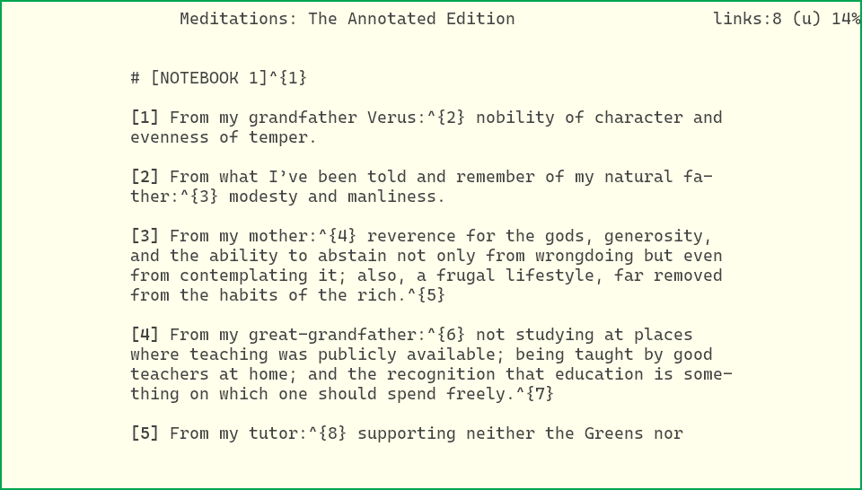

# `repy`

## ⚠️ MASSIVE WARNING ⚠️

**This is 100% AI-generated code.** Every single line was written by
[Codex CLI](https://github.com/openai/codex), [Gemini CLI](https://github.com/google-gemini/gemini-cli),
and [Claude Code](https://claude.ai/claude-code) — the human has not written a single line of Rust.
That said, it works well for daily use. No guarantee it won't eat your epub, delete your database,
or crash your terminal. You're on your own. PRs welcome.

---

Rust reimplementation of the awesome CLI ebook reader [`epy`](https://github.com/wustho/epy).

The goal is to keep the reading experience and keybindings familiar while improving
performance, robustness, and portability by using Rust and a fully self-contained
SQLite implementation.


*A clean reading experience in `repy`, showing Marcus Aurelius's Meditations with hyphenation, footnote markers, and progress tracking.*

## Status

**Functional for daily use!** Core reading features are complete: TUI navigation, search, bookmarks,
library management, two-phase cursor/selection modes, image viewing, link/footnote handling, dictionary lookup,
Wikipedia lookup, persistent highlights/comments, highlight export, and TTS (text-to-speech) all work. Text is intelligently wrapped and hyphenated.
Reading state and preferences are persisted per-book.

**Not yet implemented:** additional ebook formats beyond EPUB.

See [to-do.md](to-do.md) for detailed feature status and roadmap.

## Installation

### Download Binaries

You can download pre-built binaries for Linux, Windows, and macOS from the [GitHub Releases](https://github.com/newptcai/repy/releases) page.

- **Linux**: Download `repy-linux-x86_64` (compatible with most modern distributions).
- **Windows**: Download `repy-windows-x86_64.exe`.
- **macOS**: Download `repy-macos-universal` (works natively on both Intel and Apple Silicon Macs).

After downloading, rename the file to `repy` (or `repy.exe` on Windows) and make it executable:

```sh
# Linux/macOS
chmod +x repy-*-*
mv repy-*-* /usr/local/bin/repy
```

### Build from source

If you prefer to build it yourself, you need Rust and Cargo installed.

```sh
# Clone this repository
git clone https://github.com/newptcai/repy.git
cd repy

# Build and install
cargo install --path .
```

The bundled `rusqlite` feature is enabled, so no system-wide `libsqlite3`
installation is required; SQLite is compiled and linked as part of the build.

## Usage

### Opening a book

To open any EPUB file (doesn't need to be in your library):

```sh
repy /path/to/book.epub
```

### Starting without arguments

```sh
repy
```

If there is a reading history, `repy` reopens the last-read book at the last saved
position. Otherwise, it starts in the reader UI without a book loaded.

### Opening books from the reading history

The `EBOOK` argument can be a file path, a reading-history number, or a
pattern matched case-insensitively against the title, author, and path of
history entries (the most recently read match wins):

```sh
repy -r          # Print the reading history with numbers and progress
repy 3           # Open the 3rd book in the reading history
repy dorian      # Open the most recent history entry matching "dorian"
```

### Other options

```sh
repy -d BOOK     # Dump the parsed text of an ebook to stdout (pipe to less/grep)
repy -c FILE     # Use a specific configuration file
repy -v          # Increase verbosity (for debugging)
repy --debug     # Enable debug output
repy --export-highlights /path/to/book.epub
```

`--export-highlights` writes all persisted highlights/comments for that EPUB to
stdout. The default format is JSON (including the book identity); pass
`--format md` for Markdown grouped by chapter, with quotes, notes, and dates:

```sh
repy --export-highlights book.epub --format md > notes.md
```

### Search

Search functionality supports regular expressions.

- **Start Search**: Press `/` to open the search input.
- **Incremental**: Matches update live as you type, and the view previews the
  first match at or after your current position. `Esc` while typing cancels
  and restores the original position. Invalid partial regexes simply show no
  matches.
- **History**: `Up` / `Down` while typing recall previous queries (persisted
  across sessions, most recent first, capped at 100). `Down` past the newest
  entry restores the query you were typing.
- **Navigation**:
  - `Enter`: Confirm the query (recorded in history). Then `j`/`k` or
    `Up`/`Down` browse results, and a second `Enter` jumps and closes the
    window.
  - `n`: Jump to the next search hit.
  - `p` / `N`: Jump to the previous search hit.
- **Clear Highlights**: There is no dedicated key to clear highlights. A workaround is to press `/` to start a new search (which clears existing highlights) and then `Esc` to cancel.
- **Current Hit**: All matching text is highlighted in yellow; the line containing the current hit is highlighted in orange. A `match N/M` counter is shown in the top bar and status messages while navigating with `n`, `p`, or `N`.

## Keybindings

Press `?` in the TUI to see the help window at any time (`Help (?)`).

### Navigation
- `k` / `Up` — Line Up
- `j` / `Down` — Line Down
- `h` / `Left` — Page Up
- `l` / `Right` — Page Down
- `Space` — Page Down
- `Ctrl+u` — Half Page Up
- `Ctrl+d` — Half Page Down
- `L` — Next Chapter
- `H` — Previous Chapter
- `g` — Chapter Start
- `G` — Chapter End
- `Home` — Book Start
- `End` — Book End

### Jump History
- `Ctrl+o` — Jump Back
- `Ctrl+i` / `Tab` — Jump Forward

### Display
- `+` / `-` — Increase/Decrease Width
- `=` — Reset Width
- `T` — Toggle Top Bar
- `c` — Cycle Color Theme

### Annotations
- `A` — Highlights list
- `Enter` in highlights list — Jump to selected highlight
- `e` in highlights list — Edit comment
- `d` in highlights list — Delete highlight
- `d` in cursor mode — Delete highlight under cursor

### Windows & Tools
- `/` — Search
- `!` — Text-to-Speech (Toggle)
- `v` — Cursor Mode
- `t` — Table of Contents
- `m<char>` — Set a persistent mark (a-z, A-Z, 0-9)
- `` `<char> `` — Jump to a persistent mark
- `B` — Bookmarks (`a` to add, `d` to delete, `Enter` to jump)
- `u` — Links on Page (`Enter` previews internal links; `Enter` again jumps)
- `o` — Images on Page
  - `Enter` shows the selected image in the terminal (kitty, iTerm2, or sixel
    graphics when the terminal supports them, halfblocks otherwise);
    `Esc`/`q` returns to the list
  - `o` opens it with the external viewer instead (`default_viewer` setting,
    then `feh`, then `xdg-open`); SVG images always use the external viewer
- `i` — Metadata
- `r` — Library (reading history merged with books found on disk)
  - `j`/`k` to select an entry
  - `Enter` to open the selected book
  - `d` to delete the selected history entry
  - `s` to cycle the sort order: recent / title / author / progress
  - Books found in `library_directories` but never opened show as `new`/`unread`;
    history entries whose file has disappeared are marked `[missing]`
- `R` — Reading Statistics
- `s` — Settings
  - `Enter`: Activate (toggle boolean, input for dictionary client)
  - `r`: Reset to default
  - Dictionary command templates use `%q` as the query placeholder
- `q` — Quit / Close Window

In the Table of Contents, Bookmarks, Highlights, and Library windows, press
`/` to fuzzy-filter the list. Matches narrow as you type, best match first.
`Enter` acts on the selected entry directly, or confirms the filter so
`j`/`k` can navigate the narrowed list; `Esc` clears the filter (a second
`Esc` closes the window).

### Cursor & Selection Modes

The text-selection flow is two-phase:

1. Press `v` in the reader to enter **Cursor Mode** (`-- CURSOR MODE --` appears in the header).
2. In cursor mode, move with `h` `j` `k` `l`, word motions `w` `b` `e`, line motions `^` (first non-blank) and `$` (end of line), paragraph motions `[` and `]`, `f<char>` / `F<char>` to jump to the next / previous occurrence of a literal character on the current line, or `t<char>` / `T<char>` to land just before / after it. All motions accept a numeric count prefix (e.g. `5j`, `3w`, `2]`, `3fa`).
   - When the cursor is on a highlighted span, press `Enter` to edit that highlight's comment.
   - Press `d` to delete the highlight under the cursor; if it has a non-empty comment a confirmation popup is shown (`y` deletes, `n`/`Esc` cancels).
   - Press `C` to cycle the color of the highlight under the cursor (yellow → green → blue → pink → purple). New highlights use the last color chosen this way.
   - Rows covered by a highlight show a colored `▎` margin indicator in a 1-column left gutter (reserved as soon as the book has any highlight).
3. Press `v` again to set an anchor and enter **Selection Mode**.
4. In selection mode, move with the same motions as cursor mode (`h` `j` `k` `l`, `w` `b` `e`, `^` `$`, `[` `]`, `f<char>` / `F<char>`, `t<char>` / `T<char>`, all with optional count prefix) to expand/shrink the character-level selection (selection can cross page boundaries).
5. Press `y` to copy the selected text to clipboard.
6. Press `a` to save a highlight for the selection (using the last-used highlight color).
7. Press `c` to save a highlight and immediately edit its plain-text comment.
8. Press `d` to run dictionary lookup on the selection. By default it tries `sdcv`, `dict`, and `wkdict`. You can configure a custom command template in Settings (`s`).
9. Press `p` to run Wikipedia lookup on the selection; the popup shows a link to the page plus the summary (10s timeout).
10. Press `s` to search the selection with Ecosia in your browser.
11. Press `Esc` to leave selection mode back to cursor mode; press `Esc` again to return to reader mode.

In both cursor and selection mode, press `/` to search within the currently
visible screen and jump the cursor to the first match; `n` / `N` cycle through
matches. The query is plain text (regex specials are escaped) with smartcase
matching, and spaces in the query match across line wraps and soft hyphens, so
`/example` will find `exam-` / `ple` even when the wrapper has split the word
across two lines. In selection mode the anchor stays put, so each jump extends
the selection.

Highlights are anchored to normalized chapter text with prefix/suffix context, so they survive text-width changes and small whitespace or formatting edits. Cross-chapter highlights are not supported yet.

## Text-to-Speech (TTS)

Press `!` to toggle reading aloud from the current paragraph.

- **Engine Support**: Defaults to `purr`. Cycle through built-in presets by pressing `Enter` on the **TTS Engine** row in Settings (`s`):
  - `purr` — KittenTTS local neural TTS (default); requires [purr](https://github.com/rany2/purr)
  - `edge-tts` — Microsoft Edge neural TTS; requires [edge-tts](https://github.com/rany2/edge-tts) and `mpv` or `ffplay`
  - `trans` — Google Translate TTS; requires [translate-shell](https://github.com/soimort/translate-shell)
- **Custom engine**: set `preferred_tts_engine` in `configuration.json` to a command template:
  - `{}` is replaced with the spoken text; `{output}` is replaced with a temp audio file path
  - If `{output}` is present, repy expects the command to write audio to that path, then plays it via mpv/ffplay (with prefetch, same as edge-tts). Example:
    ```json
    "preferred_tts_engine": "mytts --text \"{}\" --wav \"{output}\""
    ```
  - If only `{}` is used, the command is expected to speak the text directly (inline). Example:
    ```json
    "preferred_tts_engine": "myengine --speed 1.5 \"{}\""
    ```
  - A bare command name with no placeholders receives the text as its sole positional argument. Example:
    ```json
    "preferred_tts_engine": "myengine"
    ```
- **Visual Feedback**: The paragraph currently being read is underlined in the UI.
- **Smart Scrolling**: The reader automatically scrolls to keep the active paragraph visible as it progresses through the book.
- **Granularity**: Text is sent to the TTS engine in manageable chunks (sentence-by-sentence) to ensure responsiveness and proper UI syncing.

## Configuration

The configuration file is automatically created on first run with sensible defaults.

### Color Themes

`repy` supports four built-in color themes:

- **Default**: Uses terminal colors
- **Dark**: Gruvbox Dark theme
- **Light**: Gruvbox Light theme
- **Sepia**: Warm paper-like palette (classic e-reader sepia mode)

Press `c` in the reader to cycle through themes. With a book open, the selected
theme is saved for that book; otherwise it is saved in `configuration.json`
under `Settings.color_theme`.

### Location

The config file location follows this priority order:

1. **XDG_CONFIG_HOME**: `$XDG_CONFIG_HOME/repy/configuration.json`
2. **Legacy XDG**: `~/.config/repy/configuration.json` (if the directory exists)
3. **Legacy home**: `~/.repy/configuration.json` (fallback)
4. **Windows**: `%USERPROFILE%\.repy\configuration.json`

If you can't find the config file, run `repy -vv` to see debug output that will
show you exactly which path is being used.

### Configuration options

The configuration is JSON with two sections: `Setting` and `Keymap`.

Example `configuration.json`:

```json
{
  "Setting": {
    "default_viewer": "auto",
    "dictionary_client": "sdcv",
    "show_progress_indicator": true,
    "page_scroll_animation": true,
    "mouse_support": false,
    "seamless_between_chapters": true,
    "color_theme": "Default",
    "preferred_tts_engine": "purr",
    "tts_engine_args": [],
    "library_directories": ["~/Calibre", "~/Books"]
  },
  "Keymap": {
    "scroll_up": "k",
    "scroll_down": "j",
    "page_up": "h",
    "page_down": "l",
    "add_highlight": "a",
    "add_highlight_comment": "c",
    "show_highlights": "A",
    "quit": "q",
    "help": "?"
  }
}
```

You can modify any setting or keybinding by editing this file. Changes take effect
on next restart.

### Library directories

Set `"library_directories"` to a list of directories to scan for EPUB files
(`~` expands to your home directory):

```json
"library_directories": ["~/Calibre", "~/Books"]
```

Opening the Library window (`r`) then shows your reading history merged with
every book found in those directories, and refreshes the list with a
background scan. Metadata is cached in the database keyed by file path and
modification time, so repeat scans only read new or changed files.

A [Calibre](https://calibre-ebook.com/) library works as-is: point
`library_directories` at the Calibre library root and `repy` walks its
`Author/Title (id)/` folder structure, reading title and author from the
`metadata.opf` file Calibre keeps next to each book (without opening the
EPUB itself). The Calibre database is never written to — the directory is
only read.

### Mouse support

Set `"mouse_support": true` (or toggle it in the Settings window, where it
applies immediately) to enable the mouse:

- The wheel scrolls the reading view (3 lines per tick) and moves the
  selection in list windows and scrollable popups.
- Left-clicking a line that contains a link follows it; if the line has
  several links, the links window opens instead.

When `mouse_support` is off (the default), the terminal keeps its native
mouse behavior, so you can select and copy text the usual way.

## Database and Reading State

`repy` stores reading history, last positions, jump history, marks, bookmarks, and highlights in a SQLite database.
The database file (`states.db`) is located in the same directory as your config file.

### Database schema

- **`reading_states`** — Current position for each book
  - `filepath`, `content_index`, `textwidth`, `row`, `rel_pctg`, optional per-book `color_theme`

- **`library`** — Metadata and reading progress
  - `filepath`, `last_read`, `title`, `author`, `reading_progress`

- **`library_files`** — Metadata cache for books found in `library_directories`
  - `filepath`, `mtime`, `title`, `author`; refreshed by the background scan

- **`bookmarks`** — Named bookmarks per book
  - `id`, `filepath`, `name`, plus position fields

- **`jump_history`** and **`marks`** — Per-book jump list and Vim-style marks
  - Jump entries are row lists; marks store a one-character name plus position fields

- **`reading_sessions`** — Reading statistics keyed by stable book identity
  - `book_id`, start/end time, duration, rows, and words

- **`books`** and **`book_aliases`** — Stable EPUB identity and path aliases
  - Book identity uses metadata plus spine href and content fingerprints, not just file path

- **`highlights`** — Persistent highlight anchors and plain-text comments
  - Stores exact text, prefix/suffix context, approximate normalized offset, color, comment, and resolution status

When you quit (`q` from the reader window), `repy` saves your current position,
updates the library entry, and flushes the active reading-statistics session.
When you open a book, it restores your last position and any stored bookmarks,
marks, jump history, highlights, and per-book theme.

## Contributing

This project is still evolving. Bug reports, small focused patches, and feedback on
feature parity with `epy` are very welcome.
